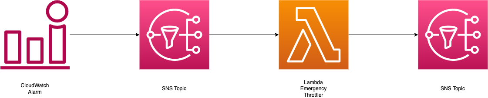

# Welcome to the Lambda Emergency Throttler project!

This is a user configurable example of a solution to prevent Lambda cost overruns. It allows you to configure a maximum number of invocations per day, and when that limit is breached, the Lambda Emergency Throttler will trigger, blocking all Lambda invocations until you manually reenable them.

This deployment guide assumes you have familiarity with the AWS Serverless Application Model (SAM) Command Line Interface (CLI). If you
are unfamiliar with the SAM CLI, please refer to this documentation: https://docs.aws.amazon.com/serverless-application-model/latest/developerguide/serverless-getting-started.html.

## Architecture:

The architecture is conceptually very straightforward. A CloudWatch Alarm monitors the account level Lambda "Invocations" metrics. This metric is for the account and region where this solution is deployed. If the daily limit is breached (10000 by default but this is user configurable upon deployment), CloudWatch will send a message to an SNS Topic. The Lambda Emergency Throttler function will execute, which will set the concurrency of all other functions in the region and account to zero, prevent their invocations. It will also send a message to a second SNS topic, which will notify all subscribers that Lambda Emergency Throttler has executed.



## Prerequisites:

1. Install the SAM CLI, which can be done here: https://docs.aws.amazon.com/serverless-application-model/latest/developerguide/install-sam-cli.html


## Deployment:

To deploy, first navigate to the LambdaEmergencyThrottler directory:
```
cd LambdaEmergencyThrottler
```

Once there, execute the SAM CLI command
```
sam deploy --guided
```
This will walk you through the deployment process. If you are deploying this for the first time and would like to test the solution, I suggest setting the invocation limit very low (100 for example) and then following the instructions in the next section

## Testing:

You are now ready to test the solution. As a warning, this will stop any function you have running in this region or account. It is recommended to only deploy this in an account where you are comfortable with that happening, and to start with a sandbox account.

There is a test function and script you can use for testing. First, deploy LambdaChaos.
```
cd ../LambdaEmergencyThrottler
sam deploy --guided
```
Once LambdaChaos has successfully deployed, you can use the createChaos.py file to simulate a large scale invocation of Lambda and see Lambda Emergency Throttler responded. To do this,
```
cd ..
python3 createChaos.py
```
And follow the prompts in your command line. As a warning, this will invoke the function as many times as you specify, up to the limit you set in Lambda Emergency Throttler.

## Reset the Solution:

To reset the solution, you have to reenable the previous reserved concurrency of your Lambda functions. This involves setting every Lambda function in that account and region back to either "Use unreserved concurrency" or to its Reserved Concurrency amount.


## Extensibility:

This solution is meant to be a jumping off point. We hope it will show others what can be done to protect their budgets from accidentally overspending on AWS Lambda. Some features that might be valuable to consider adding are:

1. Using a CloudWatch Anomaly Detection Alarm as the event source
2. Tracking and storing the current concurrency reservations of the functions in order to make reseting them more straightforward.
